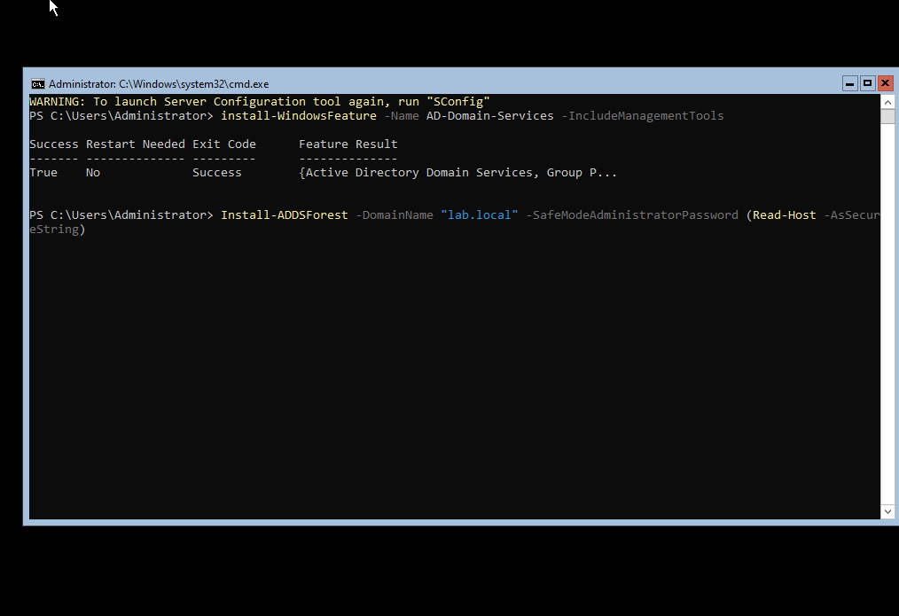
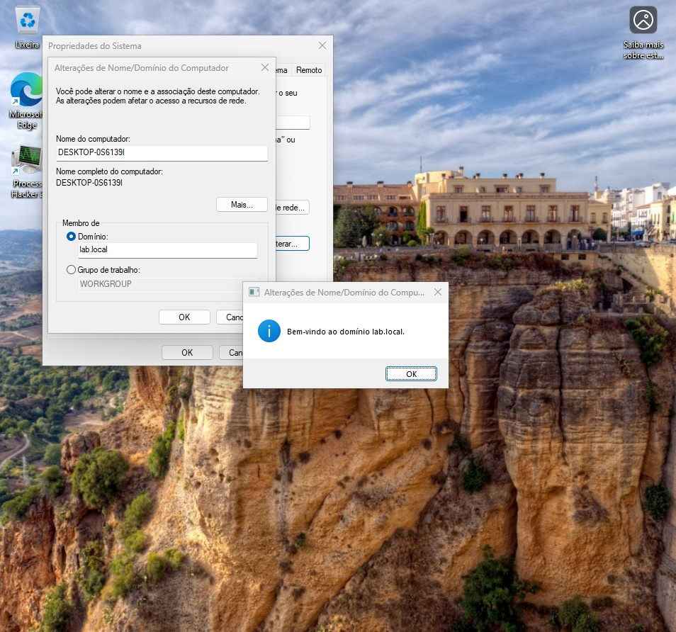
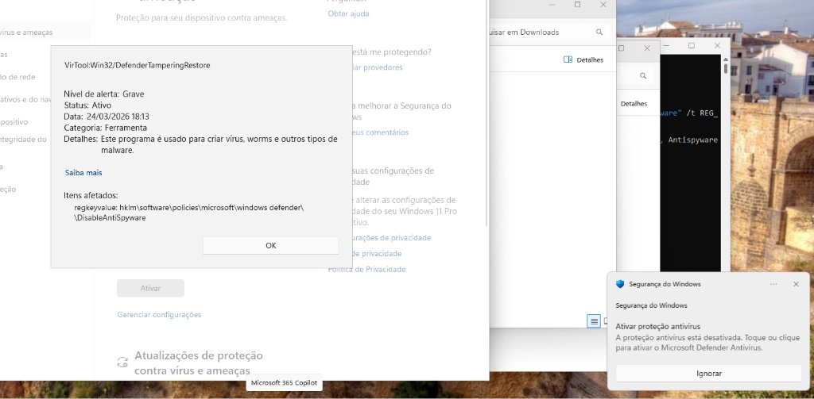
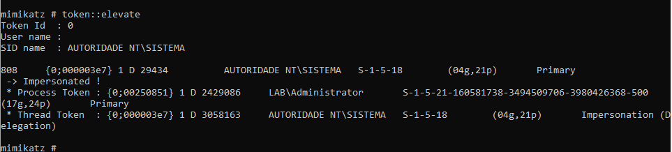
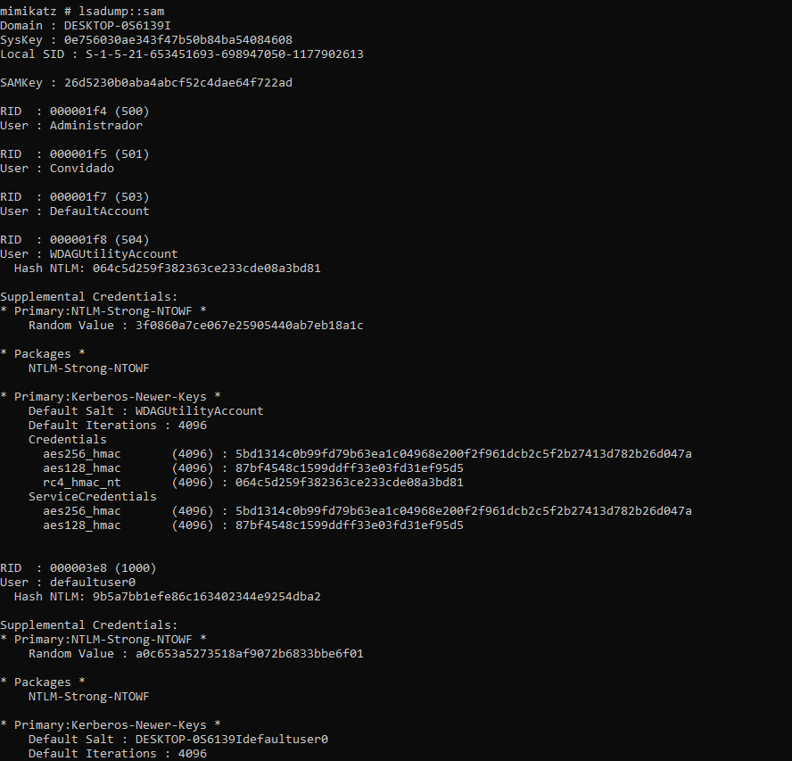
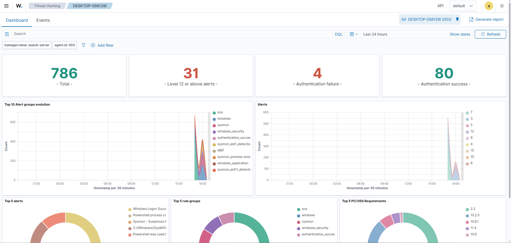
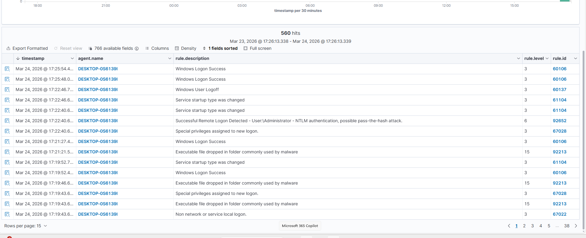

# 🛡️ Lab: Detecção de dumping de credenciais no Windows 11 com Wazuh

Montei este laboratório para ver na prática o "estrago" que o Mimikatz faz e, principalmente, como detectar esse rastro usando o Wazuh e o Sysmon. O foco aqui foi entender a telemetria gerada quando as proteções nativas do Windows 11 são desafiadas.

## 🏗️ O Setup
Não usei um ambiente pronto. Levantei as VMs do zero para simular um ambiente real:
* **DC:** Windows Server controlando o domínio `lab.local`.
* **Alvo:** Windows 11 Pro (máquina do "victim").
* **Defesa:** Wazuh SIEM recebendo logs de um agente com Sysmon customizado.

---

## ⚔️ O Ataque (Mão na massa)

### 1. Derrubando as defesas
O Windows 11 é bem mais "chato" que o 10. Tentei desativar o Defender e o LSA Protection (`RunAsPPL`) direto no registro. O Defender pegou a tentativa de manipulação, mas como eu já tinha privilégios de Admin, consegui forçar a barra.

### 2. Escalação para SYSTEM
Administrador local não é o topo. Usei o `token::elevate` no Mimikatz para "virar" SYSTEM. Esse é o ponto sem volta onde o sistema entrega as chaves de casa.

### 3. Extraindo os Hashes
Com privilégio total, rodei o `lsadump::sam`. O resultado foi a extração de todos os hashes NTLM locais (Administrator, Guest, etc). Esses hashes poderiam ser usados agora para um ataque de Pass-the-Hash na rede.

---

## 🛡️ O que o Blue Team viu? (Análise no Wazuh)

Aqui foi onde o lab ficou interessante. O SIEM não ficou quieto:
* **Alertas de Nível 12:** O Wazuh detectou comportamentos anômalos no `svchost.exe` logo após a escalação de privilégio.
* **Logon de Sistema:** Consegui isolar o evento **4624 (Tipo 5)**. Ele confirma que um processo (Mimikatz) representou uma identidade de sistema. É a prova digital do roubo de token.

---

## ⚠️ Observações de Campo (O que não está nos livros)
Durante o dump, a VM do Windows 11 apresentou lentidão extrema e acabou travando. Isso aconteceu pela manipulação direta da memória do processo `lsass.exe`. 

**Lição aprendida:** No SOC, um servidor que trava do nada ou apresenta lentidão súbita após um alerta de registro pode ser um indicativo de que um atacante está tentando (ou falhando) ao extrair credenciais. O monitoramento de comportamento (`Event ID 10` e `4624`) salvou o dia aqui.
